# F1_10th_Level3_ADAS_Algorithm_ACC_ALK

## Project 1: Embedded System and Sensor Signal Processing

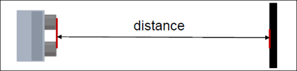

Task Overview
Challenges faced
Solutions Implemented

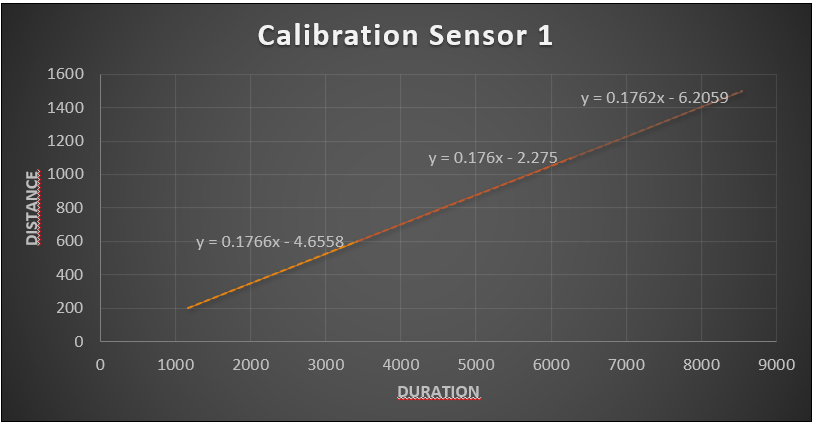
 
Task Overview
Challenges faced
Solutions Implemented

Task - 1 : Use an Ultrasonic Sensor to accurately measure the distance from an orthogonal object
Steps sequence for the Task 1:

Sampling the time data from the ultrasonic sensor.

Filtering the time data using Kalman filter. 

Calibration to map the time data to real distance after filtering the data using a fitting function.
To prevent the effect of environmental conditions on the observed data we used the same room to
calibrate the sensor i.e. auditorium.
• Same object was used as a reference every time so that the change in surface did not affect the data
observed by the sensor.
• The value of y_prediction of the Kalman filter was initialized as the first measured value by the sensor
for the first iteration of the loop. This was done to reduce the convergence time successfully from 11sec
to 6 sec.
Used piece-wise calibration equation.
• After using piece-wise calibration, the accuracy increased from +/-8mm to +/- 3mm.

Task - 2 : Sensor fusion of two Ultrasonic Sensor

Steps sequence for the Task 2:

• Sampling the time data from the ultra-sonic sensor.
• Calibration to map the time data to real distance using a fitting function.
• Fusion of two ultrasonic sensors to filter the distance data received after calibration
using Kalman filter

• Solutions of task 1 were implemented.
• Calculated standard deviation for each
sensor. Used the sensor with most reliable
data.
• Used a solid board with demarcations to get
more accurate and reliable results.

Task - 3 : Ultrasound-based Localization System

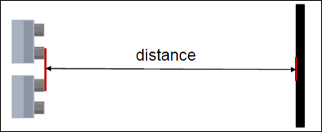

Steps sequence for the Task 3:
•Sampling the time data from the two ultra-sonic sensor.
•Calibration to map the time data to real distance using a fitting function.
•Localization done to calculate x and y coordinates.
•Fusion of two ultrasonic sensors to filter the x and y coordinates received after calibration
using Kalman filter.

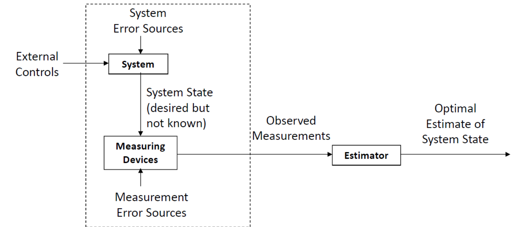

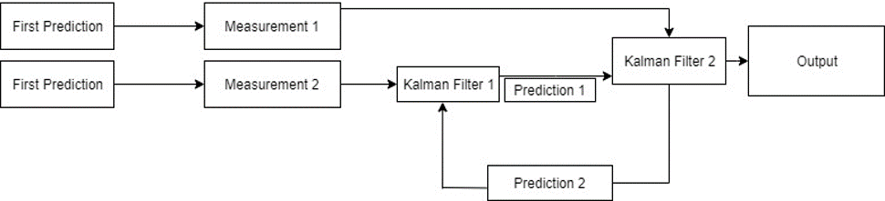

Kalman filter

Solutions implemented
• Used multiple sensors 
• Inverted one of the sensors to increase the range.
• Tried different approaches to find x-coordinates.
➢ Method 1
Used area of triangle formula (Heron’s formula)
and Pythagoras theorem to find out x coordinate.
➢ Method 2
Using distance formula

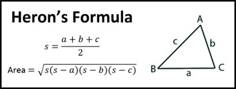

• Used modular design for sensor mounting to vary
distance between sensors which covers maximum
detection area.

Hardware Setup

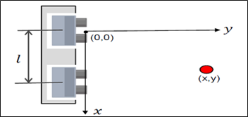

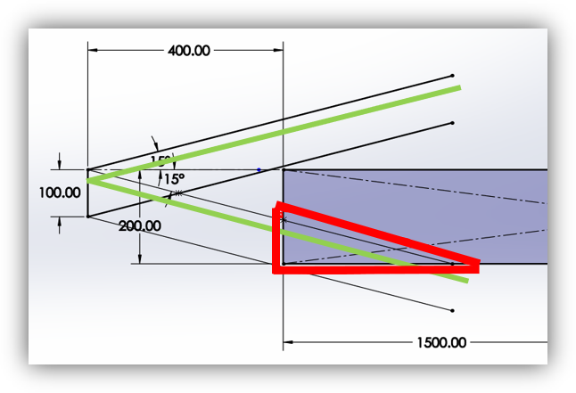

Result:

Convergence in 7.8 seconds.
Piece-wise calibration gave us an accuracy of +/- 5 mm.
Coefficients of calibration function for sensor 1 and 2 as below: Sensor 1 A= 0.1757 B= -3.8058 Sensor 2 A=0.1759 B= -8.8477

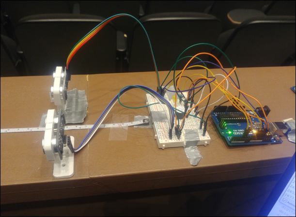

## Project – 2: Adaptive cruise control and autonomous lane keeping

Hardware_Setup 

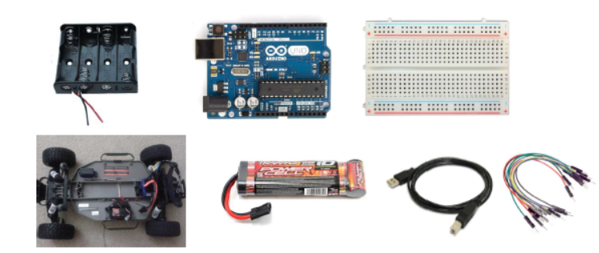

Assemblying the car and 3D printed custom mounts for sensors and battery

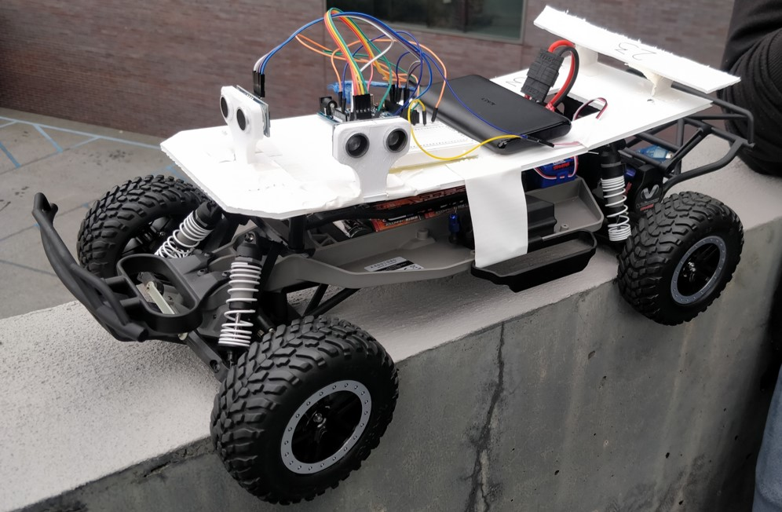

Adaptive Cruise Control
• Ensures that the vehicle cruises at a
distance of 30 cm from the object ahead.
• If obstacles ahead are stationary, vehicle
should stop at 30 cm away from the
obstacles

Solutions implemented
• Implemented a dead zone to stop the vehicle without fluctuations.
• Active duty cycle was increased to adjust the vehicle to move in the reverse direction.
• Exponential filter was implemented for throttle control to dampen the noise.
• For larger distances, a preset forward speed was given when sensor received zero value

Exponential filter

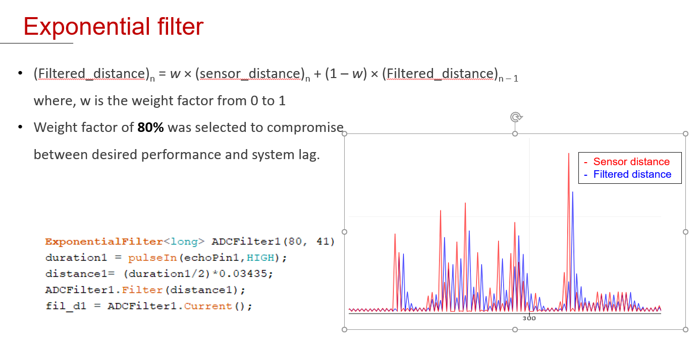

(Filtered_distance)n = w × (sensor_distance)n + (1 – w) × (Filtered_distance)n – 1
where, w is the weight factor from 0 to 1
• Weight factor of 80% was selected to compromise
between desired performance and system lag.

PID Tuning

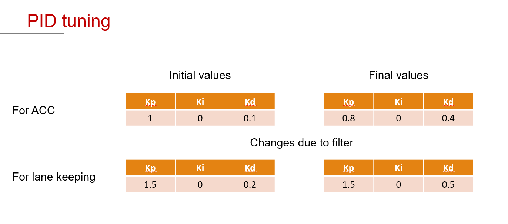

Pulse width Modulation

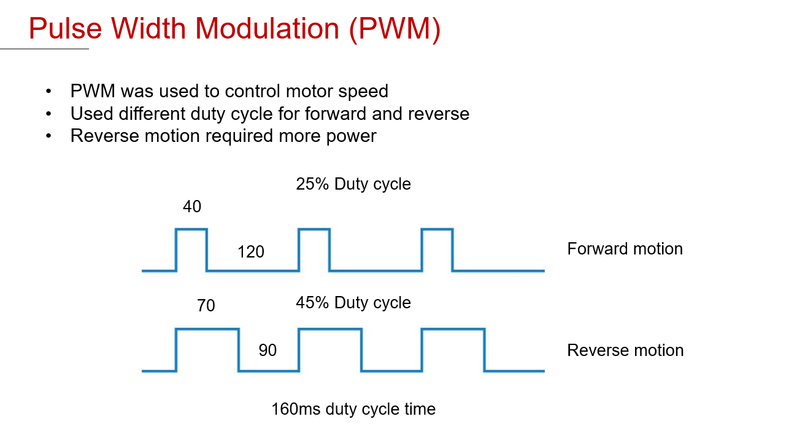

Adaptive cruise control and autonomous lane keeping

Keep the vehicle along the center of a
defined lane

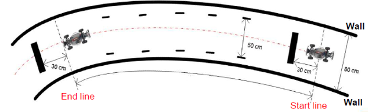

Challenges

 Response time of the steering was very slow when the PID was implemented.
Car could not steer well when it moved at high speed(Slope).
Random fluctuations in steering when going down the ramp

Solutions implemented
Exponential filter was implemented for the Steering control to prevent random
fluctuations.
Duty cycle for the ESC motor was reduced to reduce the speed of the vehicle so that the
car can steer well.
PD controller was implemented to decrease the response time of the steering.

# Results

Lane Keeping

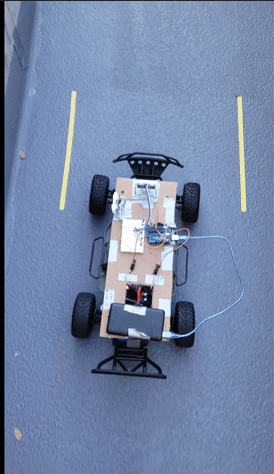

Cruises 30cm away from the obstacle

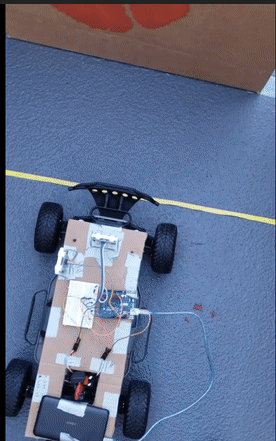

Fastest lap recorded: Course completed in 23 sec.

Only one attempt.

All checkpoints cleared.
